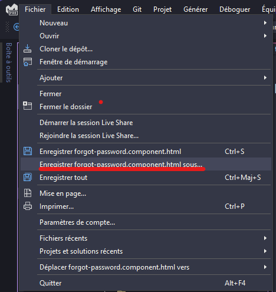
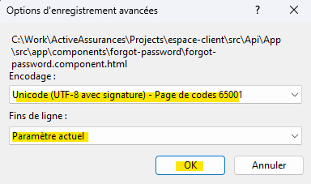

# How to encode a file with UTF-8 with BOM with Visual Studio

> Sometimes, some encoding errors can occurs. For fixing it with Visual Studio, you need to follow the followings steps:

## Save as...

## Save with Encoding...

## Select UTF-8 with signature

