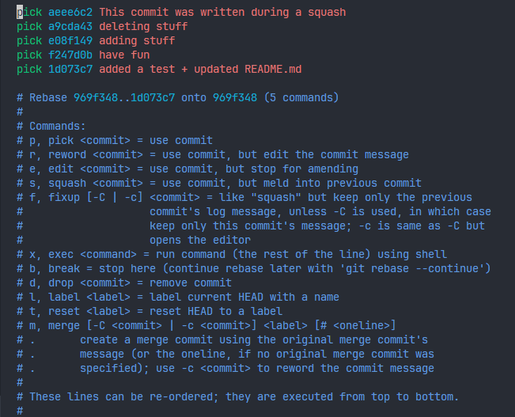
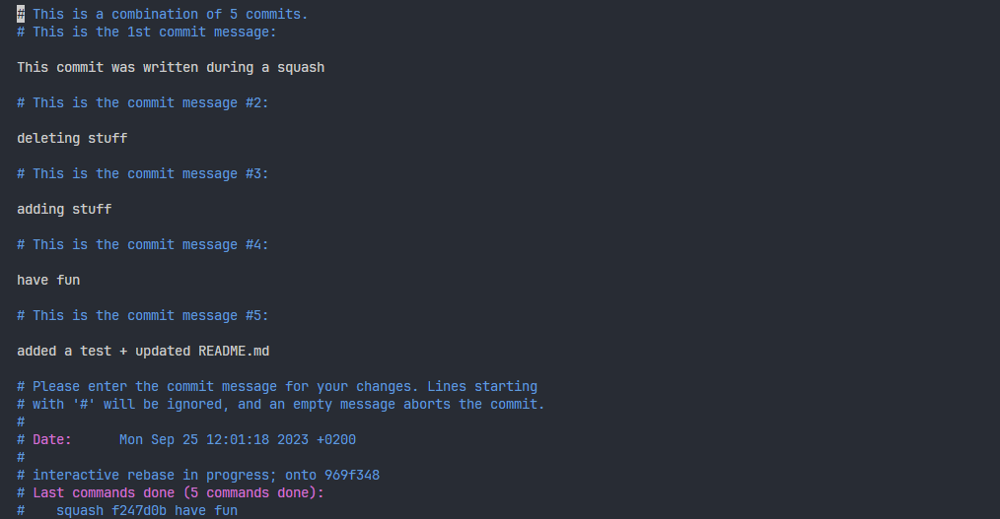
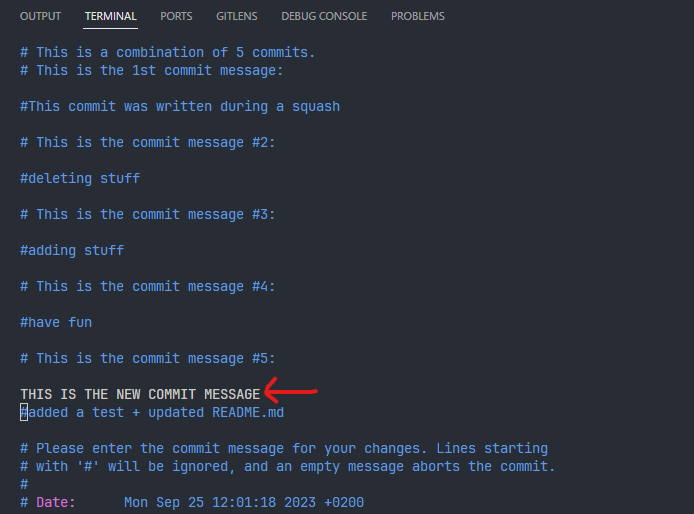
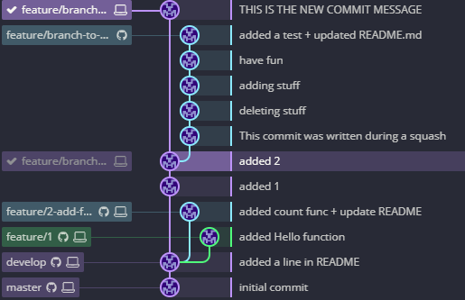
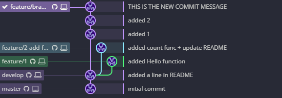

# How to squash some commits in a branch

`git checkout <branch_name_to_be_squashed>` 
Select the commit SHA from the commit just before where you want to start squashing (from the oldest)

Enter `git rebase -i <SHA>`

Text editor will open. Every commit are listed from oldest to newest, top-down. Change every `pick` by `squash` for every commit you want to squash. Then save and exit editor.

Another editor will open, listing all commits, just comment every one and write a new commit message.

Now, your graph look like this locally !

you just need to `git push -f` now.

